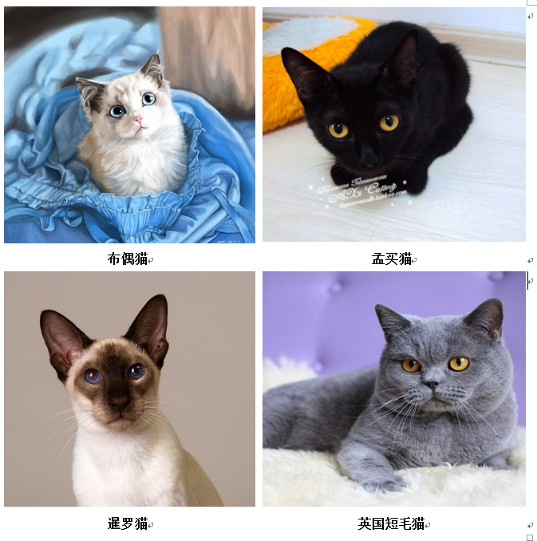
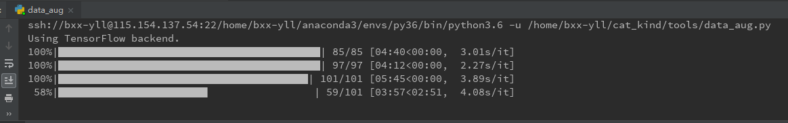
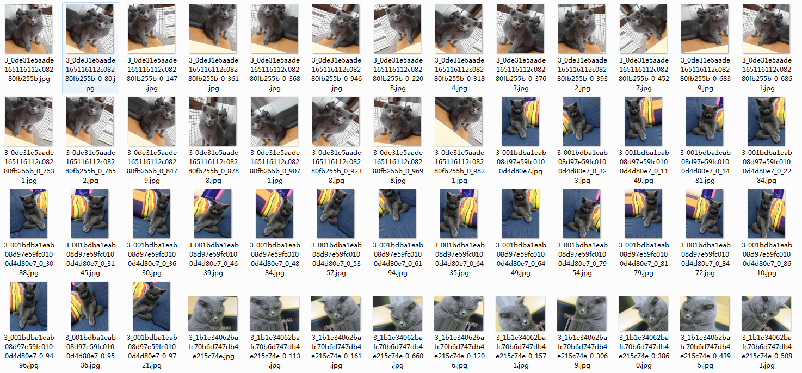

## 神经网络实现猫的种类识别

### 实现的主要部分有
+ 简单的网络结构在猫的种类识别上的应用，测试准确率0.832
+ 使用resNet50在猫的种类识别上的应用，测试准确率0.866
+ 使用数据增强解决过拟合问题，并提高测试准确率，测试准确率0.999

### 项目文件夹说明
    
    ------
    cat_kind  项目文件名
        |----cat_data_resNet50  存放用于resNet网络训练的数据
            |----train      训练数据
            |----test       测试数据
        |----cat_kind_data  存放用于简单案例网络训练的数据（train.py）
            |----train      训练数据
            |----test       测试数据
        |----dataAug    数据增强后存放训练集的位置
        |----models     保存训练模型的位置
        |----predict_imgs   测试过程中使用的图片文件夹
        |----resnet_example     使用resnet网络的文件夹
            |----predict_on_resnet.py   预测的时候使用的文件
            |----resnet50.py    定义resnet网络的文件
            |----train_on_resnet.py     训练resnet的文件
        |----source_images      数据集的原始文件夹
            |----孟买猫
            |----布偶猫
            |----暹罗猫
            |----英国短毛猫
        |----tools      工具文件夹
            |----data_aug.py    数据增强
            |----prepare_data.py    数据预处理
        |----predict.py     使用简单网络进行预测的文件
        |----requirement.txt    环境依赖
        |----train.py       使用简单网络进行训练的文件
#### step1 数据集预处理
使用文件：prepare_data.py

包括的操作有：

##### 图片重命
+ 在renameJPG()方法实现，重命名的意图有两个，第一是将图片都统一为一种图片类型，
第二个目的是给图片添加训练标签（当然也可以将标签写在文件当中，这里只是一种简便的
做法）

##### 图片转换为统一的格式
+ 图片重命名保存的过程中将图片统一格式

##### 图片统一大小
+ 该网络要求输入图片的大小为(100,100),所以运行时要修改out_img_size为(100,100)，数据集保存位置save_dir为cat_kind_data

##### 将图片按照一定的比例划分
+ 按照比例9:1将数据划分为训练集和测试集,默认参数为0.9

#### step2 训练
+ 使用文件：train.py，直接执行

#### step3 测试
+ 使用文件：predict.py，直接执行

### 二 使用经典网络ResNet50实现猫的种类识别
+ 由于resnet网络较为复杂，在少量的数据集情况下结果容易出现过拟合，所以首先进行数据增强的处理
#### step1 数据增强

直接运行data_aug.py，然后会在dataAug文件夹下生成四个对应猫种类的文件夹，相应的参数可以在data_aug.py调整

#### step2 数据集预处理
使用文件：prepare_data.py

包括的操作有：

##### 图片重命名
+ 在renameJPG()方法实现，重命名的意图有两个，第一是将图片都统一为一种图片类型，
第二个目的是给图片添加训练标签（当然也可以将标签写在文件当中，这里只是一种简便的
做法）

##### 图片转换为统一的格式
+ 图片重命名保存的过程中将图片统一格式

##### 图片统一大小
+ 在resNet中要求图片的大小在197——224之间，这里将图片的大小统一在224*224

##### 将图片按照一定的比例划分
+ 按照比例9:1将数据划分为训练集和测试集

#### step3 定义网络结构
+ 网络结构采用Keras搭建好的resNet50，使用文件：resnet_example/resnet50.py

+ 使用文件：resnet_example/resnet50.py,原始文件可从[deep-learning-models](https://github.com/fchollet/deep-learning-models)
获取，为了使得该文件能适应训练加测试，我做了相应的修改

#### step4 训练
+ 使用文件：resnet_example/train_on_resnet.py

#### step5 测试
+ 使用文件：resnet_example/predict_on_resnet.py

### 三 模型文件及数据集下载
原始图片数据集及两个网络的模型文件已经分享到百度云

链接：https://pan.baidu.com/s/1mGWuguEAH5tdDEZV_0QRHw 
提取码：wz5c 

